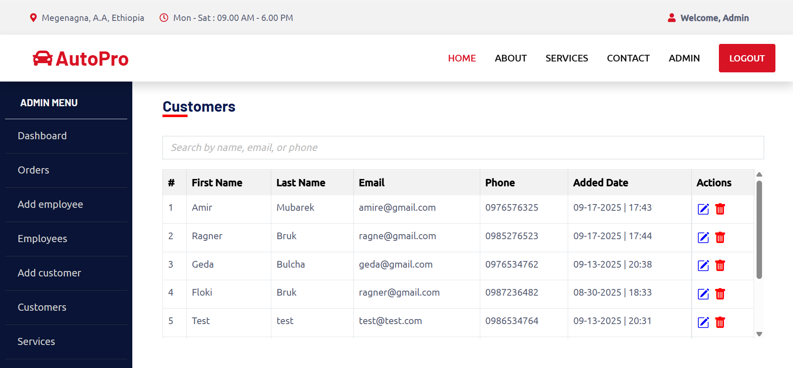

# 🚗 AutoPro Garage Service Management System

A full-stack **Garage Service Management System** built with **Node.js, Express, MySQL, and React**.  
This project provides an **Admin Dashboard** to manage customers, employees, vehicles, services, and orders, making garage operations efficient and organized.

🔗 Live Demo

AutoPro Garage Service Management System Live Demo

---

## 📸 Preview

| Dashboard |
|--------------------|
|  |


---

## ⚙️ Features

✅ Manage Customers, Employees, Vehicles, Services, and Orders  
✅ Role-based Authentication (Admin/Employee)  
✅ CRUD Operations with MySQL Database  
✅ Service Order Tracking with Linked Records  
✅ Secure Authentication (bcrypt, JWT if enabled)  
✅ RESTful API Endpoints for Integration  
✅ Clean Admin Dashboard 

---

## 🚀 Tech Stack

| Layer     | Technology             |
|-----------|------------------------|
| Frontend  | React, Bootstrap       |
| Backend   | Node.js, Express       |
| Database  | MySQL                  |
| Security  | bcrypt, JWT (optional) |
| Config    | dotenv                 |
| Tools     | Nodemon, Postman       |

---

## 🧑‍💻 Getting Started

### 1. Clone the Repository
```bash
git clone https://github.com/amirmub/Garage-Service-app.git
cd Garage-Service-app

```

### 2. Install Dependencies
```bash
npm install
```


## 📬 Contact
📧 Email: amirmubarek01@gmail.com <br>
💻 GitHub: @amirmub
